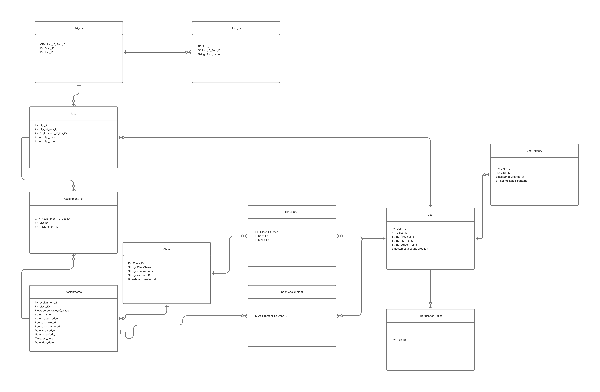

# Canvas To-Do Prioritizer — IS 401 Module 05

**Status:** the authenticated completion action is verified locally at `http://127.0.0.1:4182/`: save, database readback, refresh persistence, reversal, and rejection of a stale save all passed. The app is ready to record with three incomplete synthetic assignments. Recording and Canvas submission are pending. The newer `chat` and `message` tables still require sample rows and an access decision.

**Latest setup progress:** Cameron approved and applied `docs/finish-demo.sql` on October 9. The shared Supabase Auth account exists, each existing table received three synthetic rows, and account-specific completion access is enabled. The browser-safe key and assignment IDs `1`, `2`, and `3` are configured. `docs/verify-access.sql` passed against the real database and rolled its test writes back: allowed demo read/completion; denied name changes, inserts, deletes, user-table access, another identity, and signed-out access.

**Sign-in resolved:** the dashboard verified that the synthetic `test@user.com` account had no email-confirmation timestamp. With Cameron's explicit approval, `docs/confirm-demo-email.sql` confirmed that exact account; the result showed `email_confirmed=true`, and the existing password then signed in successfully. The SQL is a historical record and must not be rerun. Supabase dashboard access uses the administrator's account; the frontend uses the separate demo account. `docs/check-demo-auth.sql` remains an unexecuted diagnostic draft. No password was changed.

The read-only `docs/table-status.sql` was executed successfully against the current database and returned the seven-table counts below. See [live verification evidence](docs/live-verification.md) for the browser results and screenshots.

## App Summary

Canvas To-Do Prioritizer is a student task-organizing prototype for IS 401.
Its existing interface presents assignment cards with due dates, estimated time, grade weight, and priority.
Students can view tasks in the main list, by class, or in the study view.
The calendar and sorting controls help students compare upcoming work.
The Module 05 implementation connects the existing completion checkbox to Supabase’s database API.
A shared demo account signs in to load synthetic assignments, and the interface changes completion only after the database confirms the saved value.
Canvas synchronization and the assistant remain prototype behavior, while completion persistence has been verified against the live database.

## ERD



[Original Nolan FigJam board](https://www.figma.com/board/gDGWPCcKeUJ4qBRlZElBHT/401-Group-Assignment-ERD?node-id=0-1).
This is the team's exported diagram.

At initial inspection on October 9, the project contained six empty tables with RLS disabled. Cameron approved adding three synthetic rows to each existing table and restricting client access. The schema subsequently changed: `chat_history` is absent and `chat` and `message` have appeared. The latest live audit shows:

| Current table | Sample rows | RLS |
| --- | ---: | --- |
| `Class` | 3 | Enabled |
| `Class_User` | 3 | Enabled |
| `assignments` | 3 | Enabled |
| `user` | 3 | Enabled |
| `user_assignment` | 3 | Enabled |
| `chat` | 0 | Disabled |
| `message` | 0 | Disabled |

Only the shared account can read the three demo assignments and update their completion column. The other four seeded tables have no client access. The new chat tables require sample data and an access decision before the team treats the entire schema as ready; they were preserved during this work.

The ERD also includes list, sorting, and prioritization-rule entities absent from the current database. The diagram gives assignments a class foreign key; the actual `assignments` definition has no class column and instead references `user_assignment`. Tasks therefore display **Shared demo**, without inventing an assignment-to-class relationship. Nolan/Lex should reconcile the diagram and schema before submission.

## Tech Stack

| Layer | Choice | Why it fits the team |
| --- | --- | --- |
| Frontend | Existing HTML, CSS, browser JavaScript | Preserves the team's interface without a framework migration for one action. |
| Client | Supabase JavaScript v2 | Supplies sign-in and database requests. |
| Backend | Supabase Auth and generated Data API | Uses the team's selected Supabase project and shared-account demo. |
| Database | Supabase PostgreSQL | Stores completion and supports the existing relational tables. |
| Local preview | Node.js built-in HTTP server | Serves static files; it is not the database backend. |

The vertical slice updates **`public.assignments.completed`** using **`assignment_id`** as the unique key. Loading reads `assignment_id`, `name`, `percentage_of_grade`, `completed`, `priority`, `due_date`, `est_time`, and `deleted`. Deleted rows are excluded. Dates use America/Denver. The frontend creates no tables or sample rows.

The adapter filters the unique ID and prior completion value, then requests and checks the saved row. This follows [Supabase's update-and-return API](https://supabase.com/docs/reference/javascript/update). The browser uses only a [publishable key](https://supabase.com/docs/guides/getting-started/api-keys); authorization requires [row-level policies](https://supabase.com/docs/guides/database/postgres/row-level-security).

## How to Get It Running

### Current project setup

**Already applied:** the shared Auth account, three demo assignments, and their policies are configured. Use the frontend below. Do not rerun the initial seed script or replace the current policies: the schema has changed since it was applied.

1. Open the [canvas_prioritizer project](https://supabase.com/dashboard/project/uowlwdwrqceklbqjcnmc). The applied setup is recorded in `docs/finish-demo.sql`; its original six-table schema is historical.
2. Sign in with the shared **Supabase Auth** demo account Cameron created (`test@user.com`). Keep its password out of the repository, README, and recording. A row in `public.user` is a separate record, not an Auth account.
3. `config.js` already contains the project URL, browser-safe publishable key, and assignment IDs `1`, `2`, and `3`. Never substitute a secret/service-role key, database password, or Auth token.
4. `docs/verify-access.sql` records the completed, rolled-back role/claim tests. It validates assignment access rather than auditing the newer chat tables. `docs/demo-access-review.sql` is an earlier unapplied reference draft; do not execute it against the changed schema.
5. For another project, first inspect its schema and existing data, then adapt the setup and obtain the appropriate access approval. The current seed script intentionally stops if data or policies already exist.

Configuration shape (replace placeholders):

```js
window.APP_CONFIG = {
  supabaseUrl: 'https://uowlwdwrqceklbqjcnmc.supabase.co',
  publishableKey: 'sb_publishable_REPLACE_WITH_PUBLIC_KEY',
  demoAssignmentIds: ['REPLACE_WITH_REAL_SYNTHETIC_ID']
};
```

### Open the frontend

Use Node.js from its official distribution. From this repository folder run:

```text
node serve.cjs
```

Open `http://127.0.0.1:4181/`, sign in with the shared account, and wait for **assignments loaded from Supabase**. Use `node serve.cjs 4182` if port 4181 is in use. Internet is required for the client CDN and Supabase.

GitHub Pages deployment should be checked separately after publishing source changes; local verification does not establish deployment. Missing configuration shows **Demo setup pending**. Failed loads show an error and no fixture cards. An empty successful load indicates sample rows or their access policies need checking.

## Verifying the Vertical Slice

[Recording and submission checklist](docs/return-checklist.md) contains the completed checks and remaining team tasks.

### Reproduce the live check

1. Sign in and identify one incomplete sample assignment. Note its ID and a second row's completion value in Supabase Table Editor.
2. Click the first assignment's circular checkbox. It is disabled and shows **Saving…** during the request.
3. After confirmation, the card moves to **Completed**, its title is crossed out, and the status reads **Saved to Supabase · completed**.
4. Refresh the database table; verify only that row's `completed` value became `true`.
5. Refresh the frontend. It must reload from Supabase and remain checked under Completed.
6. Uncheck the row. Verify UI, database, and another page refresh show `false`; verify the second row stayed unchanged.
7. Check a fresh browser tab and the browser console. A tab in the same browser shares the existing login session.
8. Test an unconfirmed save using two signed-in tabs: load the completed row in both, uncheck it in the second tab, then try to uncheck the stale checked card in the first. Its previous-value condition matches no row. The first tab must show an error and retain its displayed checked state. Reload assignments to reconcile. A disconnected-network save can be checked separately.
9. Click repeatedly during Saving. The row must remain disabled; a rapid double click should leave one confirmed state. The simulated held-request test additionally checks that only one adapter call is made.
10. Complete the access-control allow/deny checks above before sharing the app.

### Checks completed

- Read the actual assignments schema and verified the six tables existed, were empty, and had RLS disabled.
- Exported and visually inspected Nolan's ERD.
- Refreshed the public repository in a separate checkout; upstream HEAD was `4350906964e93ea0334efbe4b6f8a7e579dbaada`.
- `node test.cjs` passed simulated saves, reload from simulated storage, reversal, row isolation, failed load/save, stale-value rejection, saving-control locks, repeated-click lock, mismatched saved response, text escaping, and ID validation.
- Chrome opened the local frontend and showed **Demo setup pending**, no fixture cards, and no captured console errors/warnings. This verifies the unconfigured page only.
- Applied the approved synthetic-data and access setup; assignments `1`, `2`, and `3` were returned with `completed=false`.
- Executed the real PostgreSQL role/claim allow-deny checks in `docs/verify-access.sql`; all assertions passed and test updates were rolled back.
- Re-audited the changed schema: five current tables each have three rows with RLS enabled; the newer `chat` and `message` tables are empty with RLS disabled. Their definitions and foreign keys were inspected without altering them.
- Resolved the exact demo account's email-confirmation blocker with approval, then signed in and loaded three real synthetic assignments.
- Completed ID `1`; the app showed the confirmed completed state, a live database query returned `true`, and a full page refresh retained completion. IDs `2` and `3` stayed `false`.
- Opened a fresh tab sharing the same login, reversed ID `1`, and refreshed to verify `false` persisted.
- Tested a stale save using those two tabs. The app reported an unconfirmed save, preserved the displayed prior value, and reconciled correctly when reloaded. No administrator failure-test SQL was executed.
- A rapid double click showed Saving with the checkbox and reload/sign-out controls disabled, then one completed state. Network request counts and a deliberately slow connection were not measured; the simulated held-request check verifies one adapter call.
- Captured no console errors or warnings during the final normal authenticated page check. Offline failure is simulated, not a live disconnected-network test.
- Restored all three assignments to incomplete for recording. [Evidence and screenshots](docs/live-verification.md) record the completed live checks.
- **Pending:** team review of the new tables and ERD/schema differences, deployed-site verification, video, and Canvas submission.

### Demo script — target 60–90 seconds

The local live checks passed. Start signed in and keep credentials out of view.

| Time | Show and say |
| --- | --- |
| 0–15s | Incomplete synthetic assignment. “Our existing completion checkbox is connected to Supabase.” |
| 15–35s | Click, wait for Saved, show the Completed card. “The backend returned the saved value.” |
| 35–55s | Refresh and show the checked assignment after loading. “The change persists because it reloads from the database.” |
| 55–75s | Uncheck, show the confirmed result, and briefly point to the README and ERD. |

One Canvas text entry per team needs the **actual demo-video link** and **repository/README link**. The video must be no longer than two minutes. Links are ready only after recording/uploading the video and publishing reviewed changes.

### Prototype limits

- Creation/deletion are unavailable in this demo; only completion is persisted.
- Sorting, lists, rules, drafts, and preferences remain temporary prototype state.
- The assistant uses scripted replies and is not an AI service.
- Canvas connection/settings are prototype controls with no real Canvas integration.
- Shared-account access is a class demo choice. Real student data requires a reviewed individual ownership model and policies.
