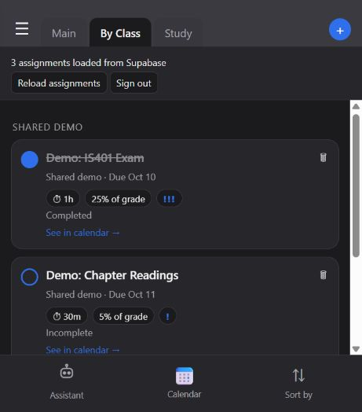
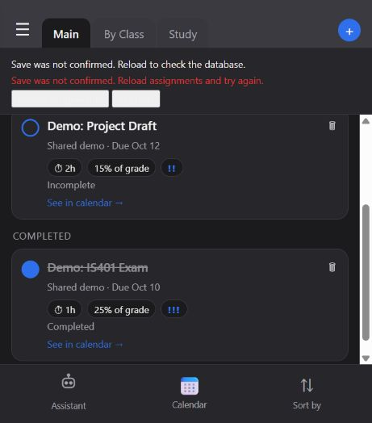
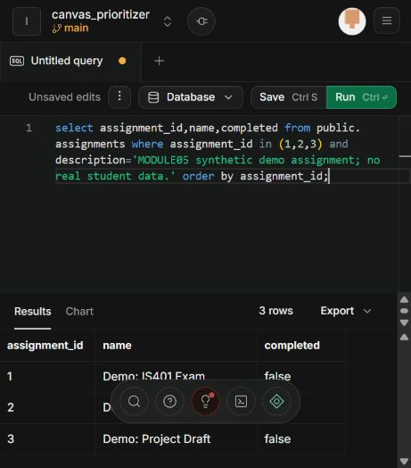

# Live completion verification

Verified locally against the team's Supabase project, using the shared synthetic demo account and assignments 1, 2, and 3. These are observed results from the authenticated browser and database, separate from the simulated tests in test.cjs.

| Check | Observed result |
| --- | --- |
| Sign-in | The exact synthetic Auth account was confirmed with Cameron's approval. Existing credentials signed in and loaded three assignments. |
| Complete ID 1 | The UI showed the saved completed value. A database SELECT returned true; IDs 2 and 3 remained false. |
| Full page refresh | Reloaded three assignments from Supabase with ID 1 still checked. |
| Fresh tab | A newly opened tab sharing the same browser login loaded the saved completed state. |
| Reversal | Unchecking ID 1 saved false; a refresh retained that value. |
| Stale save | Tab B reversed ID 1 while tab A retained its earlier checked value. Tab A's attempted reversal matched no row, showed an unconfirmed-save error, and retained the displayed checked value. Reload reconciled to the database's false. |
| Rapid clicks | A double click showed Saving and disabled the row and reload/sign-out controls, then left ID 1 complete once. Other assignments stayed incomplete. |
| Normal console | No captured errors or warnings during the final normal authenticated page check. |
| Final reset | All three assignments restored to incomplete and reloaded for recording. |

## Evidence

After a full refresh, By Class makes the checked assignment visible at the top:

The independent database readback:

The controlled stale-save error:

Final database readback after resetting for recording: all three completion values are false.

## Limits and remaining work

The fresh tab shares a login session; it is not an independent account or browser profile. Request counts and a deliberately slow connection were not measured live. Held-request call counts and disconnected-request failure are simulated tests. The access checks in verify-access.sql exercised real PostgreSQL roles and claims with rollback, rather than a second account's browser login.

The new empty chat and message tables and ERD/schema differences still require team review. This evidence does not establish publication, video upload, or Canvas submission.
